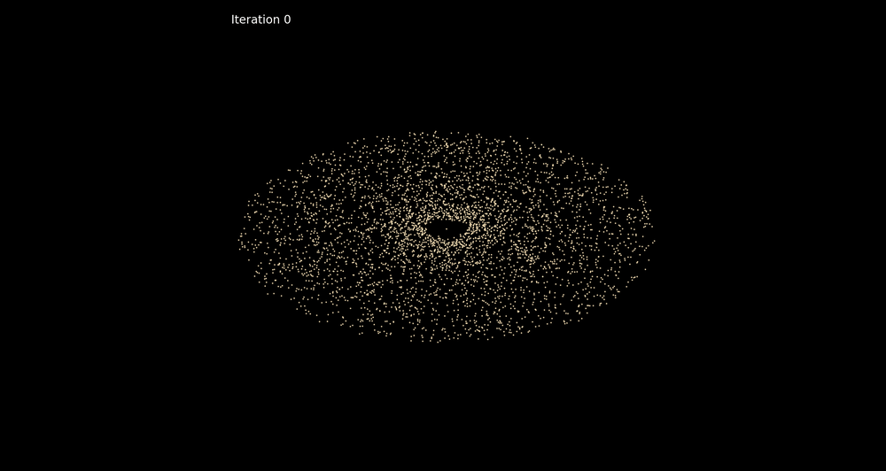
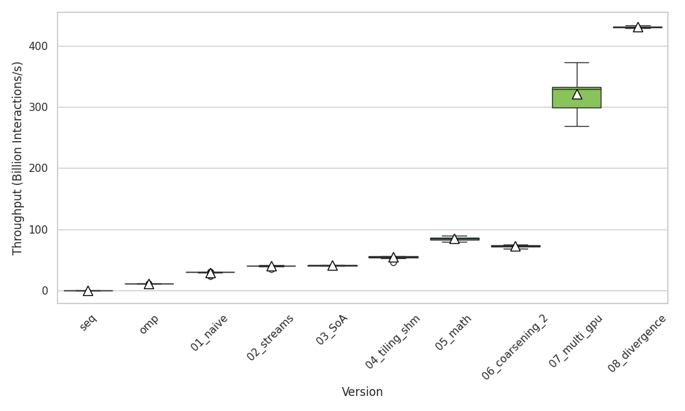
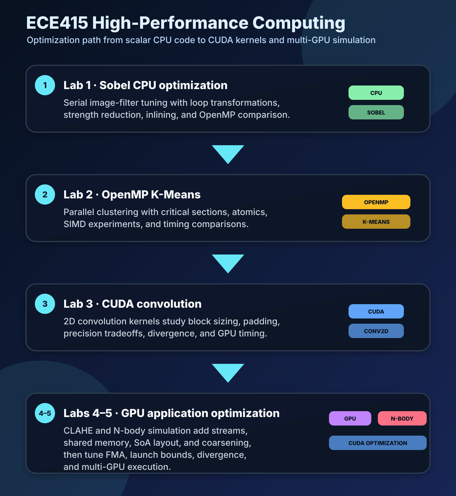

# ECE415 — High-Performance Computing

High-performance computing coursework for ECE415 at the University of Thessaly. The labs start with CPU-side profiling and loop-level optimization, then move through OpenMP, CUDA kernels, CUDA streams, memory-hierarchy tuning, and multi-GPU execution.

Core tools: C, OpenMP, CUDA, Python, NVIDIA profiling tools.

## Standout work

The strongest part of the repository is **Lab 5**, where the final assignment builds an N-body simulator for galaxy-style particle systems. The lab starts from a sequential gravitational simulation and grows into a full CPU/OpenMP/CUDA performance study with multiple GPU implementations and correctness comparisons.

- **CPU and OpenMP baselines:** sequential and OpenMP implementations provide reference outputs and performance baselines.
- **CUDA optimization ladder:** the GPU versions explore naive kernels, streams, Structure-of-Arrays layout, shared-memory tiling, fast math/FMA variants, thread coarsening, launch-bound tuning, divergence-reduction variants, and multi-GPU execution.
- **Measured performance path:** scripts collect run logs and CSV summaries so implementation choices can be compared with throughput plots instead of only raw terminal timings.
- **Extra visualizer work:** beyond the base simulator, the repository includes a custom dataset generator and an animation of the N-body output.

<p align="center">
  
</p>

<p align="center">
  
</p>

## Requirements

- Linux environment
- `gcc` and `make`
- Python 3 for data generation and plotting scripts
- OpenMP-capable GCC
- NVIDIA CUDA toolkit (`nvcc`) for Labs 3–5
- NVIDIA GPU hardware for CUDA execution
- Optional: NVIDIA Nsight Systems / Nsight Compute for profiling

Python plotting scripts use packages such as `numpy`, `pandas`, `matplotlib`, and `seaborn`.

## Build and run

Each lab keeps its own scripts and Makefiles. Typical entry points are:

```bash
cd Lab1 && ./run.sh
cd Lab2 && ./run.sh
cd Lab3 && ./run.sh
cd Lab4 && ./run.sh
cd Lab5 && ./run.sh --help
```

Lab 5 examples:

```bash
cd Lab5
./run.sh --iterations=10 --cpu=omp --gpu=on --file=06_coarsening_2.cu --input=galaxy_data.bin
./run.sh --iterations=5 --cpu=seq --gpu=off --input=galaxy_data.bin
python3 generate_custom_dataset.py 1 4096 galaxy_1x4096.bin
```

## Course contents

<p align="center">
  
</p>

| Directory | Topic | Implementation summary |
|---|---|---|
| `Lab1/` | Sobel CPU optimization | Serial C optimization passes for Sobel edge detection, including loop interchange, unrolling, fusion, inlining, common-subexpression elimination, strength reduction, and OpenMP comparison. |
| `Lab2/` | OpenMP K-Means | Parallel K-Means clustering with OpenMP, SIMD/critical/atomic experiments, timing scripts, and report plots. |
| `Lab3/` | CUDA convolution | CUDA 2D convolution kernels covering block sizing, precision behavior, image padding, divergence effects, and runtime comparisons. |
| `Lab4/` | CUDA CLAHE | Contrast Limited Adaptive Histogram Equalization with multiple kernels, privatized histograms, scans, coalesced memory access, streams, events, and profiling plots. |
| `Lab5/` | N-body simulation | CPU, OpenMP, CUDA, stream, shared-memory, coarsening, multi-GPU, and divergence-reduction versions of a galaxy N-body simulator. |

## Reports and handouts

| Lab | Report | Handout |
|---|---|---|
| Lab 1 | [`Lab1/Lab1.pdf`](Lab1/Lab1.pdf) | [`Lab1/Lab1.pdf`](Lab1/Lab1.pdf) |
| Lab 2 | [`Lab2/report.pdf`](Lab2/report.pdf) | [`Lab2/Lab2.pdf`](Lab2/Lab2.pdf) |
| Lab 3 | [`Lab3/report.pdf`](Lab3/report.pdf) | [`Lab3/lab_3.pdf`](Lab3/lab_3.pdf) |
| Lab 4 | [`Lab4/report.pdf`](Lab4/report.pdf) | [`Lab4/Lab4.pdf`](Lab4/Lab4.pdf) |
| Lab 5 | [`Lab5/report.pdf`](Lab5/report.pdf) | [`Lab5/Lab5.pdf`](Lab5/Lab5.pdf) |

## Running individual labs

Most lab directories include a `run.sh` wrapper and a `src/` directory with the implementations used by that lab. The final CUDA labs also include plotting or data-collection helpers for recreating the report measurements.

Example Lab 5 structure:

```text
Lab5/src/                  CPU, OpenMP, and CUDA N-body implementations
Lab5/run.sh                main execution wrapper
Lab5/gather_data.sh        repeated-run data collection
Lab5/create_csv.py         result-log aggregation
Lab5/create_plot.py        throughput plotting
Lab5/generate_dataset.py   base random input generator
Lab5/generate_custom_dataset.py  galaxy-style visualizer input generator
```

## Repository map

```text
Lab1/        Sobel CPU optimization and OpenMP comparison
Lab2/        OpenMP K-Means implementation and plots
Lab3/        CUDA convolution kernels and precision/runtime studies
Lab4/        CUDA CLAHE versions, profiling, and stream/event experiments
Lab5/        N-body CPU/OpenMP/CUDA implementations, profiling, results, and visualizer scripts
docs/images/ README graphics and selected result figure
```
